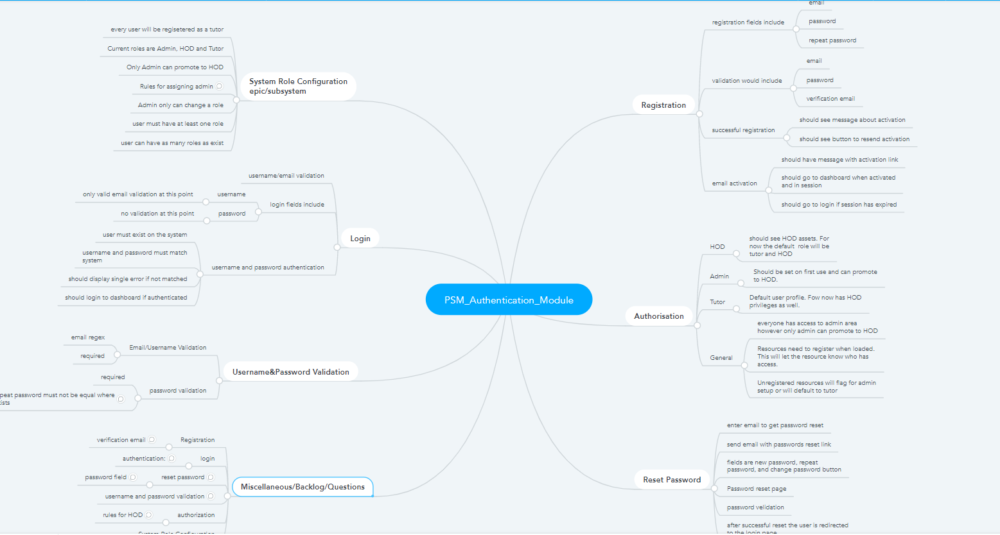

# Registration/Authentication Epic --> Login Feature
The authentication system will enable the user to authenticate securely and based on their role will allocate what the user sees and has access to.

<!--  -->

## Introduction

As a user 
I want to log in with my credentials 
so I can access the system


### Acceptance Criteria (Rules)

1. email and password and password confirmation fields are mandatory
2. Password and confirmation password field must be masked
3. No validation checks necessary
4. Should log in if authenticated

### Scenarios
1. Login with valid credentials
2. Login with invalid email (invalid email, password and unregistered email, **unverified email, blank field)
3. Login without acount link verification

```gherkin
Feature: Login

Scenario: 1 Login with valid credentials
    # Given user is on the login page
    # When user enters valid email and password
    # Then Login is successful
    # And user is redirected to their dashboard

Scenario: 3 Login with invalid email

    # Given that I can access the portal
    # When I enter an innvalid email
    # Then Login is unsuccesful
    # And  an error message is displayed.

```


