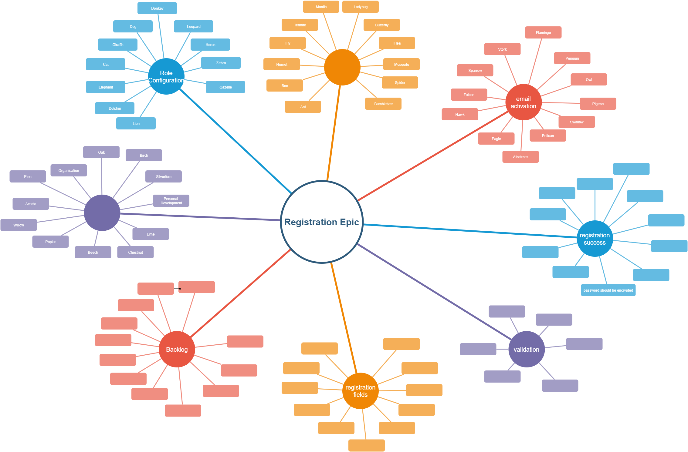
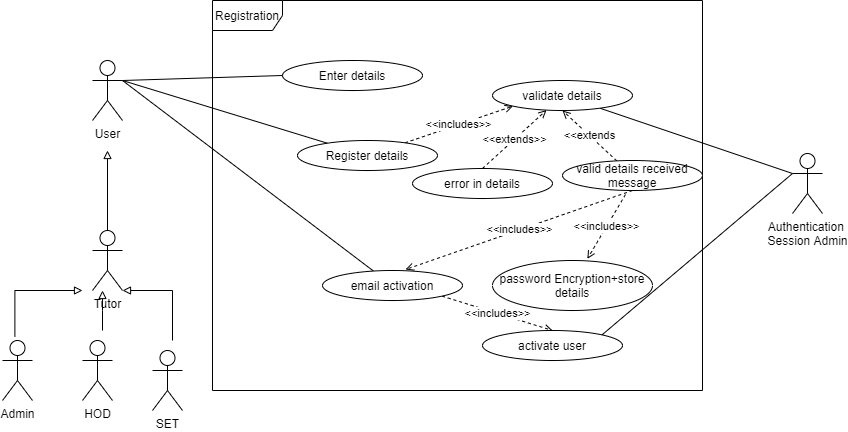

# Registration and Authentication Module --> Registration Epic
The authentication system will enable the user to authenticate securely and based on their role will allocate resources to the as per what the user sees and has access to.

## Introduction

The registration epic allows the user to create a login for the Progressive Student Management.  This epic has the following features:

1. Registration Details
1. Validatoin
1. Registration Process Successful
1. Email Activation
1. User Activation/Registration Process Complete

As a user I want to register on the platform so I can access the platform. The use case for this user story is as follows:

### Acceptance Critera

1. email and password and password confirmation fields are mandatory
2. user is allowed one account per email (i.e a user cannot use one email to register multiple accounts)
3. All users are registered as tutors by default
4. Password and confirmation password field must be masked

## A. Enter Details
As A user I would like to enter my details to during the registration process

### Acceptance Critera
The fields would include
1. User email
1. Password
3. Repeat Password

## B. Validate Details
As A user I would like to be notified if there are any problems while entering my details during the registration process.

### Acceptance Critera
1. 

## C. Registration Initiation Successful
As A user I would like to be notified that my details has been entered into the system and that the registration process has been initiated.

### Acceptance Critera
1. 

## D. Email Activation
As A user I would like to complete the registration process by clicking the activation link in my email before it expires.

### Acceptance Critera
1. 

## E. Activate User/Registration Complete
As A user I would like to be notified of the Registration Process completion after email activation

### Acceptance Critera
1. 
