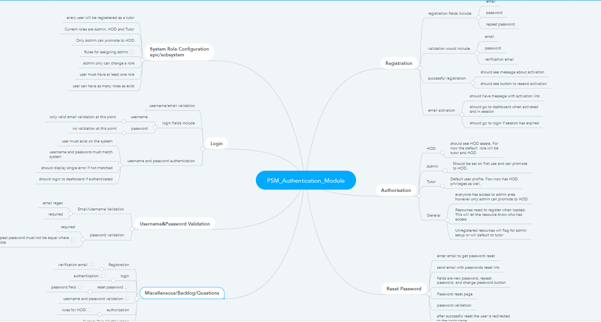
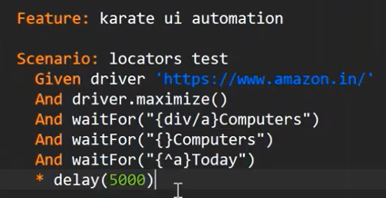

# Registration/Authentication Module --> Role Configuration Epic
## Introduction
The authentication system will enable the user to authenticate securely and based on their role will allocate what the user sees and has access to.

<!--  -->

## Role Configuration

As an admin I want to set the assign role-based permissions to users of the system
### Acceptance Criteria
1. The first user of the system automatically becomes admin
1. **A tutor can change status to HOD
**Only one HOD is allowed on the system (i.e 2. if a tutor has assigned HOD to self no other can reassign HOD status)
3. **An admin can asign HOD status to tutor
4. ***How would the system identify different departments
5. if a tutor is unregistered , can an admin assign a class
6. Admin assisgns class

### Scenarios

