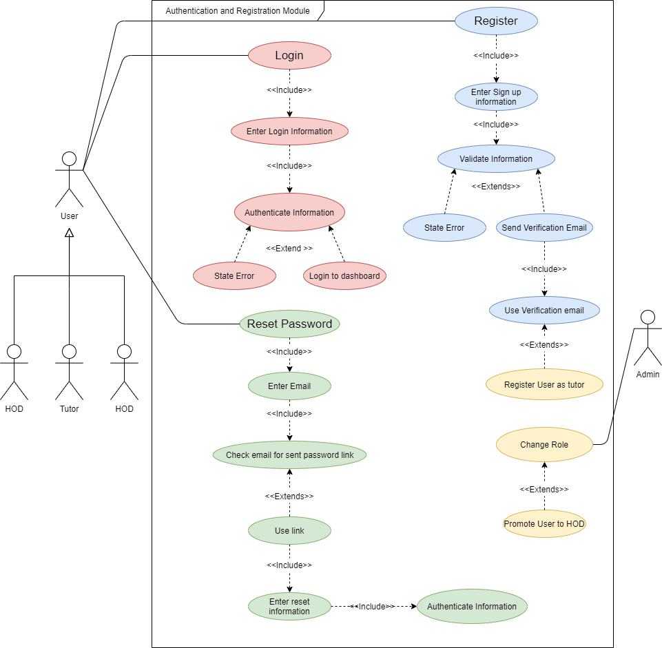

# Registration/Authentication Epic --> System Role Configuration and Authorisation Sub-epic
The authentication system will enable the user to authenticate securely and based on their role will allocate what the user sees and has access to.

<!--  -->

## System Role Config

### Acceptance Criteria (Rules)

1. **Only Admin can change tutor status to HOD
**Only one HOD is allowed on the system (i.e if a tutor has assigned HOD to self no other can reassign HOD status)
**An admin can asign HOD status to tutor
***How would the system identify different departments
if a tutor is unregistered , can an admin assign a class
Admin assisgns class
2. It is possible to get a list of collections (entities) from the database directly
3. This will be a server-side functions that you can get from the repository implementation

### Scenarios

