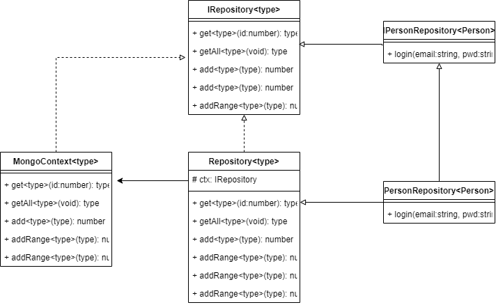

# Repository Pattern
The goal of the repository pattern is to abstract the data layer of your application into a collection of reusable objects.

The class diagram for the repository pattern is as follows

Here we see that the IRepository interface declares 8 methods
1. get()
1. getAll()
1. add()
1. addRange()
1. remove()
1. removeRange()
1. find
1. serverFun()

We also use a strategy pattern to represent the different data strategies i.e how object relational mapping is achieved and connection to the database.