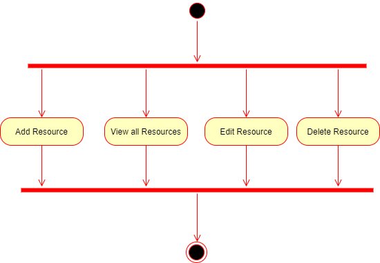

# Student Manager -> Admin Epic -> Resource Entity Super Scenario (sub-feature)
## Introduction

The admin is used by user's with the admin role. This page is used to interact with the database.  This super feature has the following sub-features
1. Select Resources to view all Resources
1. Add a Resource Entity
2. Remove a Resource Entity
1. Modify a Resource entity
1. View all Resource entities

## Resource Fields
1. ID  --> Int
2. ResourceName --> String
3. ResourceUrl --> String
4. ResourceCategory --> Enum (Int)

## Sub-Features and API Design
These features listed above have the following API resources
1. Add a Resource  --> [post] /dashboard/admin/resource
2. Remove a Reource --> [delete] /dashboard/admin/resource
3. Modify a Resource [patch] /dashboard/admin/resource
4. View all resources --> [get] /dashboard/admin/resource

## Sub Features
### A. Add a Resource entity feature 

As a user with the admin role, I should be able to add different instances of an entity to the database

#### Acceptance Criteria (Rules)

1.The added Resource item should be seen in the database

### B. Remove a Resource Entity

As a user with the admin role, I should be able to modify different instances of an entity to the database

#### Acceptance Criteria (Rules)

1. the removed resource should no longer be in the database

### C. Modify a Resource Entity
As a user with the admin role, I should be able to remove different instances of an entity to the database

#### Acceptance Criteria (Rules)

1. The original and modified Resource from the database should differ in at least a field

### D. View all Resource Entities

There will be a side bar with an admin dropdown (expandable) showing all the entities 
#### Acceptance Criteria (Rules)
1. It is possible to get a list of collections (entities) from the database directly
1. This will be a server-side functions that you can get from the repository implementation
1. If you select Resource from the side bar, the list of all Resource entities should be displayed in the screen
1. Should be able to sort
1. Should be able to filter
1. Should be able to modify pagination
1. Should be able to create new entity from page
1. Should be able to edit/delete entity from view
1. Select multiple records to delete

