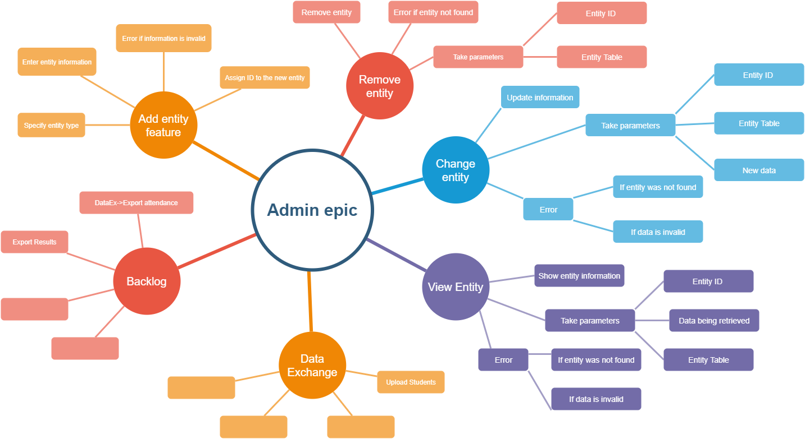

# Student Manager -> Admin Epic
## Introduction

<<<<<<< HEAD
The admin is used by users to interact with entities managed by the database. 

=======
The admin is used by user's with the admin role. This page is used to interact with the database.  This epic has the following features
1. Add Entity
2. Remove Entity
1. Modify entity
1. View all entities
5. Select entity to view
1. Data Exchange

>>>>>>> a648ff4fe336bb2d97d3d10d05c92a5ea2338e4f

## A. Add entity feature 

<<<<<<< HEAD
As a user, I should be able to add different instances of an entity to the database
=======
As a user with the admin role, I should be able to add different instances of an entity to the database
>>>>>>> a648ff4fe336bb2d97d3d10d05c92a5ea2338e4f

### Acceptance Criteria (Rules)

<<<<<<< HEAD
1. The entity being added needs to be inserted into the database
2. The table where the entity belongs is determined by the UI
2. The user needs to enter the entity's information
3. If the information entered is invalid, the program should not add the entity
4. A unique ID is assigned to the new entity

## Scenearios

1. The information is invalid 
2. The information is valid and the new entity is created

# B. Remove entity feature 

As a user with the admin role, I should be able to remove an entity from the database

## Acceptance Criteria (Rules)

1. The user needs to specify the table where the entity belongs and the entities unique ID (Implied from UI)
2. If the ID doesn't match any entity on the table, then the program should display an error
3. If the ID is found, the entity should be removed from the table

## Scenearios

1. The ID doesn't match any entity
2. The ID matches an entity on the table and the entity is removed

# C. Change entity feature 

As a user with the admin role, I should be able to change the an entity's data

## Acceptance Criteria (Rules)

1. The user needs to specify the table where the entity belongs, the entities unique ID and the data being updated
2. If the ID doesn't match any entity on the table, then the program should display an error
3. If new information is invalid, the program should display an error
4. If there are no errors, the data on the specified entity is updated 

## Scenearios

1. The ID doesn't match any entity on the table
2. The data being added is invalid
3. The data and the ID are valid, the entity's infomation is updated

# D. View entity feature 

As a user with the admin role, I should be able to see the entities on the database. I should also be able to specify what information I want to see.

## Acceptance Criteria (Rules)

1. The user needs to specify the table where the entity belongs and the entity's unique ID
2. The user can specify what information it wants to see from the entity 
3. If the ID doesn't match any entity on the table, then the program should display an error
4. If the information being retrieved is not related to the specified entity, the program should display an error 
4. If there are no errors, the entity's specified data is shown to the user 

## Scenearios

1. The ID doesn't match any entity on the table
2. The data being requested is invalid
3. The data and the ID are valid, the entity's specified infomation is shown

# E. Data exchange feature 

As a user with the admin role, I should be able to export and import data from and to the database

## Acceptance Criteria (Rules)

1. The user can upload students to the database

=======
1. 

## B. Remove Entity

As a user with the admin role, I should be able to modify different instances of an entity to the database

### Acceptance Criteria (Rules)

1. 

## C. Modify Entity
As a user with the admin role, I should be able to remove different instances of an entity to the database
### Acceptance Criteria (Rules)

1. 

## D. View all Entities

This view shows a configurable list of all the records of a particular entity.

### Acceptance Criteria (Rules)

1. Should be able to sort
1. Should be able to filter
1. Should be able to modify pagination
1. Should be able to create new entity from page
1. Should be able to edit/delete entity from view
1. Select multiple records to delete

## E. Select Entity to view from a list of all entities

There will be a side bar with an admin dropdown (expandable) showing all the entities 

### Acceptance Criteria (Rules)

1. It is possible to get a list of collections (entities) from the database directly
1. This will be a server-side functions that you can get from the repository implementation
1. 

## F. Data Exchange
As a user with the admin role, I should be able to remove import student list into the persons table from a csv file.
### Acceptance Criteria (Rules)
>>>>>>> a648ff4fe336bb2d97d3d10d05c92a5ea2338e4f

1. 
