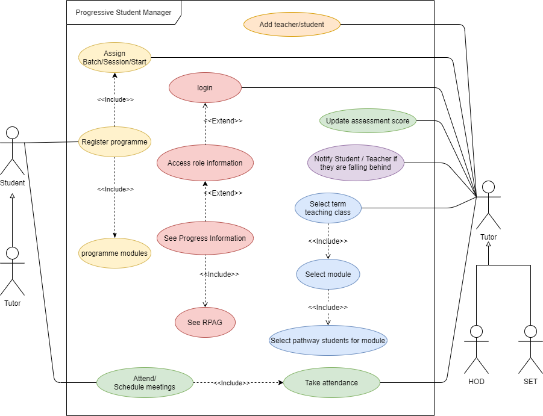

# Welcome to the 2021 Summer Progressive Student Manager Hackathon
The Progressive Student Manager (PSM) enables tutors, administrators and all student caretakers manage students in at the Foundation or Year 1 College level.  The phase one is a single user system design for a single tutor with the capability of handling multiple modules and the students taking those modules.  While the Phase 1 of the PSM application has been completed, the hackathon will focused on the implementation of the Phase 2 features of the PSM solution.

## PSM Phase 1 - Features
The roadmap for the features of the PSM Phase 1 is given in the figure below.


Screenshots of some of the main features of the Phase one are given in the images below:
### Group module list

### Taking attendance

### RPAG KPI


# Hackathon Tutorials
This are organised into the following sections
- Markdown
- Git
- Html
- CSS/Bootstrap
- Typescript
- Angular

## Markdown
It is the aim of this hackathon to add a `Readme.md` file in every folder of this project.  This readme will have a brief description of the purpose and contents of this folder.  The `Readme.md` file is written using markdown which adds formatting capabilities to ordinary text files such as the one you are reading right now.  Please follow the markdown guide in the link below when doing your own readme.md to document the folders you create.
### Useful Markdown links
- [Markdown guide](https://guides.github.com/features/mastering-markdown/)
- [Markdown cheatsheet](https://github.com/adam-p/markdown-here/wiki/Markdown-Cheatsheet#links)

## Git

Follow the link below for a quick tutorial on git and github

[](https://www.youtube.com/watch?v=HkdAHXoRtos).


### Setup Git and Download this repository
You will need to have a github account to participate in this hackathon.  Here are the steps required to have a local copy of this repository on your computer.
#### Step 1: Register a github account at https://github.com.
#### Step 2: Setup Git on your computer
If you don't have git setup on your computer you can set up git by following the following steps:

First launch power shell by clicking on the start button, type `powershell` and hit enter.  This will bring up the power shell console.  In the powershell console type the following commands
```bash
Set-ExecutionPolicy RemoteSigned -scope CurrentUser
iwr -useb get.scoop.sh | iex[
scoop install git nodejs
```
#### Step 3: Finally clone this repository using git
Launch windows explorer and navigate to the folder you wish to clone this source code repository and then in the address bar of windows explorer type `cmd`.  This will open up a console window.  Once in the console window type the following command.
```bash
git clone https://github.com/JohnAPedagogy/ProgressiveStudentHackathon.git
```
If you completed the above three steps; Congratulations!  You are all setup and ready for this hackathon.

## Additional hackathon resources and useful links
- [HTML Layout](https://www.geeksforgeeks.org/html-layout/)
- [Semantic html cheat sheet](https://learn-the-web.algonquindesign.ca/topics/html-semantics-cheat-sheet/)
- [Semantic HTML cheatsheet](https://www.w3schools.com/html/html5_semantic_elements.asp)
- [HTML Crash course](https://www.youtube.com/watch?v=UB1O30fR-EE)
- [CSS Crash course](https://www.youtube.com/watch?v=yfoY53QXEnI)
- [Typescript cheatsheet](https://devhints.io/typescript)
- [Object oriented programming with javascript](https://www.youtube.com/watch?v=PFmuCDHHpwk&list=WL&index=433)
- [Restructured Text vs Markdown](https://www.youtube.com/watch?v=v4eoYpCON_c)
- [Bootstrap tutorial](https://www.youtube.com/results?search_query=bootstrap+crash+course)
- [Bootstrap in one video](https://www.youtube.com/watch?v=gqOEoUR5RHg)
- [Bootstrap in 5 minutes](https://www.youtube.com/watch?v=yalxT0PEx8c)
- [Bootstrap cheatsheat](https://getbootstrap.com/docs/5.0/examples/cheatsheet/)
- [Flex box tutorial](https://www.youtube.com/watch?v=JJSoEo8JSnc)
- [Angular forms](https://www.youtube.com/watch?v=hAaoPOx_oIw&t=1017s)
- [Angular bootstrap](https://ng-bootstrap.github.io/#/getting-started)
- [Angular material](https://material.angular.io)
- [Angular responsive dashboard](https://www.youtube.com/watch?v=hAaoPOx_oIw&t=1017s)
- [Repository pattern](https://www.youtube.com/watch?v=rtXpYpZdOzM&t=8s)
- [Spring JPA](https://spring.io/guides/gs/accessing-data-rest/)
- [Spring boot tutorial](https://www.youtube.com/watch?v=vtPkZShrvXQ)
- [Download visual studio code](https://code.visualstudio.com/Download)

# PSM Phase 2 - Hackathon
The phase 2 of the Progressive Student Manager (PSM) will consist of 2 sprints
- Sprint 1 is the re-implementation of phase 1 with addition of an authentication system
- Sprint 2 is the development of the Progressive Student Manager (PSM) Progress information Dashboard

## Phase 2 - Technology Stack
- Team A
  - Java/H2/Mysql
  - Bootstrap
- Team B
  - MongoDB
  - Angular

### Java - Spring boot
Java Spring boot will be used to implement the back end business-logic layer of the PSM target system.  Spring boot is designed with a Microservices architecture in mind.  This means that you will be able to add the components you need to your application as you need them.  Ideally, you would have separate projects for each component and treat them as individual applications to achieve a true microservice architecture.  However, in this hackathon, all components would be in a single monolithic application.

#### Java - Spring boot - Object Relational Mapping (ORM)
The data component of Spring boot is used to encapsulate the database using the Repository design pattern.  The repository pattern abstracts the database responsibility of managing SQL statements into an in-memory database comprising of plain old java objects (POJOs) that are native Java objects and collections.  Below is a tutorial on how to setup the sprint boot ORM.  The github repository for the tutorial can be cloned from this [link](https://github.com/kriscfoster/Spring-Data-JPA-Relationships).

[](https://www.youtube.com/watch?v=f5bdUjEIbrg).

# PSM Phase 2 - Design
In this section, the design of the PSM phase 2 features are discussed.  The use-case UML diagam and the Entity Relationship models are presented in the sections below.

## Progressive Student Manager (PSM) Use Case Diagram 

The use case diagram for the PSM describes the features that we are aiming to develop with this project. The use case diagram is as follows:


## Database Design

The hackathon will utilize MongoDB and H2 databases.  At some point the H2 database will migrated to MySQL.  The Entity relationship diagram for the model is as follows:


